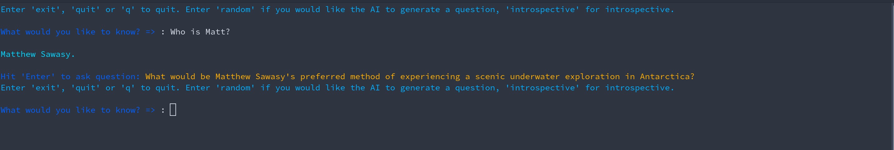

# Introspect AI

Introspect AI is a Python suite for creating a private "in-house" AI Retrieval Augmented Generation (RAG) about you.
It imports data from sources, such as email or tweets, and allows you to ask questions about yourself based on that data.

- [Introspect AI](#introspect-ai)
  - [Getting Started](#getting-started)
    - [Set up Ollama](#set-up-ollama)
    - [Set up qdrant](#set-up-qdrant)
    - [*OPTIONAL* - Set up neo4j](#optional---set-up-neo4j)
    - [Create a virtual environment and install the pip resources.](#create-a-virtual-environment-and-install-the-pip-resources)
    - [Configure](#configure)
  - [Processing data sources for use with IntrospectAI](#processing-data-sources-for-use-with-introspectai)
    - [Email](#email)
    - [Trackt.tv](#trackttv)
    - [Twitter](#twitter)
    - [Markdown Data](#markdown-data)
  - [How to use IntrospectAI](#how-to-use-introspectai)
  - [Notes](#notes)


## Getting Started

### Set up Ollama

https://ollama.com/

Note: If your GPU supports it, make sure you enable `OLLAMA_FLASH_ATTENTION=1`

### Set up qdrant

https://github.com/qdrant/qdrant/blob/master/docs/QUICK_START.md#docker-

### *OPTIONAL* - Set up neo4j

https://neo4j.com/docs/operations-manual/current/docker/introduction/


### Create a virtual environment and install the pip resources.

```bash
cd IntrospectAI
python3 -m venv venv
source venv/bin/activate
pip install -r requirements.txt
```

### Configure

```bash
cp config-example.py config.py
```
Edit to your specifications.

## Processing data sources for use with IntrospectAI

You can use any single data source or any combination with IntrospectAI

### Email

```
mkdir -p data/email
cp <Your Mbox file(s)> data/email 
```

The process for setting up your data in the AI is as follows:

1. Pre-process your data. Remove sigs from emails, removes attachements, includes only people you've emailed, etc. Run for each of your files. Can be re-run safely.
```
python 1.0-email-load_into_sqlite.py data/email/<your mbox file>.mbox
```

2. Create Facts
```
1.1-email-facts_from_sqlite.py
```
3. Create embeddings for your data. - This is location data for Qdrant to do lookups.
```
1.2-embeddings-from-facts.py
```
4. Load the data into Qdrant
```
1.3-email-load_sqlite_to_qdrant.py
```
5. *Optional* - Create relationships on your data for Graph DB
```
2-generate-relationships-from-facts.py
3-neo4j-load_graph_docs.py
```

### Trackt.tv

1. Get a Trakt.tv export

https://github.com/seanbreckenridge/traktexport

2. Copy it to the data directory
```
cp trakt.json data/
```
3. 
```
python 1-trakttv-views_emeddings.py data/trakt.json
```

### Twitter

1. Get a Xitter export

https://help.x.com/en/managing-your-account/accessing-your-x-data

2. Copy it to the data directory
```
cp <twitter-date-hash.zip> data/twitter
```
3. Create embedding files from twitter extract
```
python 1-twitter-tweet_embeddings.py data/twitter-XXXX-XX-XX-<hash>.zip
```
4. Load into qdrant
```
python 3-qdrant-load_embedded_file.py --tweet
```

### Markdown Data

This is for import data from things like Obsidian, Journals, Websites, etc.
```

```


## How to use IntrospectAI

`ask.py` - For asking the AI questions. This is the primary interface for interacting with your data. It is an interactive CLI.



`qdrant-drop-all-data.py` - A script that quickly removes the database from qdrant. Super useful for iterative testing of datasets.
`

## Notes

- The neo4j sections are commented out of `ask.py`. Uncomment them if you want to set up and use a GraphDB instance.
- When you are testing with the suite, you'll find that creating facts requires a bit of time. Because of this, I've split this into a few parts, so re-creating your database is quicker.
- I have included GraphDB as a data source, but it doesn't seem to help much in this application.
  - Considering how long it takes to generate the relationships, IMO, it's not worth the energy. YMMV.
- Aside from the embedding model, play with different models, as they can generate different results.
- This is a passion project to learn more about RAGs, so it can definitely be improved upon. Especially the prompts.
- Email is dirty data. I always have so many trouble parsing it correctly. Mostly spam.